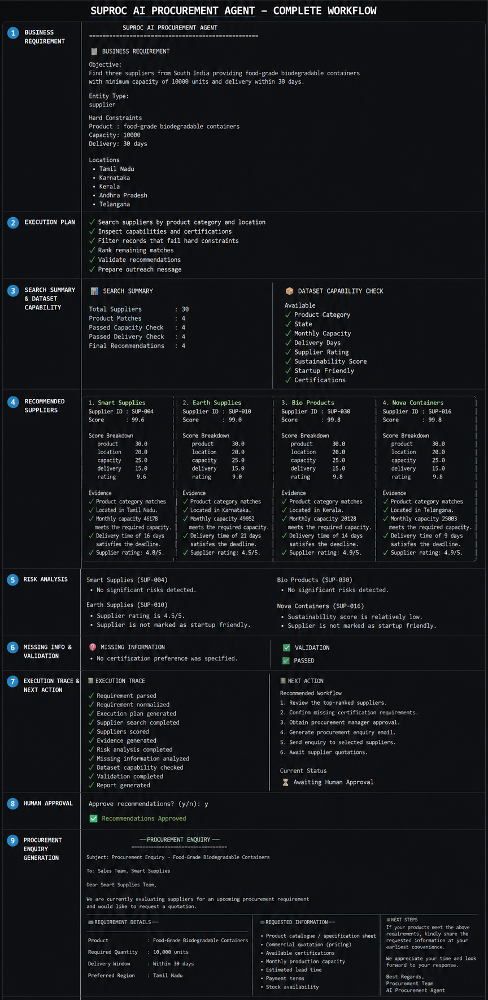

# SUPROC AI Procurement Agent


An AI-powered procurement workflow that converts natural language procurement requests into validated supplier recommendations using a local Large Language Model (Qwen3:1.7B), SQLite, transparent scoring, and human approval.

---

## Project Overview

This project was developed as part of the **SUPROC AI Engineering Assignment**.

The agent behaves as an AI workflow rather than a traditional chatbot. It converts business requirements into structured data, searches a local SQLite supplier dataset, validates every recommendation, performs self-correction when validation fails, and generates procurement enquiry drafts after receiving user approval.

The system runs completely locally using **Qwen3:1.7B** through **Ollama**.

---


## Complete Workflow

The following figure illustrates the complete end-to-end workflow of the SUPROC AI Procurement Agent.



---


## Assignment Objectives

- Parse procurement requirements using a local LLM
- Search a local supplier database
- Validate supplier recommendations
- Generate evidence-backed rankings
- Perform automatic correction on validation failures
- Protect against prompt injection
- Require human approval before procurement actions


## Key Features

- Natural language requirement understanding using a local LLM
- Requirement normalization
- Execution planning
- Local SQLite supplier search
- Constraint-based supplier filtering
- Transparent match scoring
- Evidence-backed recommendations
- Validation of recommendations
- Automatic correction loop (maximum 3 attempts)
- Risk analysis for recommended suppliers
- Missing information detection
- Dataset capability checking
- Prompt injection protection
- Human approval before procurement action
- Procurement enquiry email generation
- Execution trace logging

---


## Project Structure

```text
suproc-agent/
│
├── agent/
│   ├── controller.py
│   ├── correction.py
│   ├── dataset_capability.py
│   ├── email_generator.py
│   ├── execution_trace.py
│   ├── executor.py
│   ├── filter_by_constraints.py
│   ├── human_approval.py
│   ├── missing_information.py
│   ├── normalizer.py
│   ├── parser.py
│   ├── planner.py
│   ├── reporter.py
│   ├── risk_analyzer.py
│   ├── scorer.py
│   ├── security.py
│   └── validator.py
│
├── database/
│   ├── database_manager.py
│   ├── init_db.py
│   └── suproc.db
│
├── logs/
│
├── models/
│   ├── dataset_capability.py
│   ├── execution_trace.py
│   ├── match.py
│   ├── missing_information.py
│   ├── plan.py
│   ├── requirement.py
│   ├── risk.py
│   ├── search_summary.py
│   └── validation.py
│
├── prompts/
│
├── tests/
│   ├── restore_security.py
│   ├── seed_data.py
│   └── test_security.py
│
├── tools/
│   ├── entity_details.py
│   └── search.py
│
├── utils/
│   └── constants.py
│
├── app.py
├── config.py
├── requirements.txt
├── README.md
└── .gitignore
```

---


## System Architecture

```text
                         +----------------------+
                         |     User Request     |
                         +----------+-----------+
                                    |
                                    v
                     +-----------------------------+
                     | Requirement Parser (LLM)    |
                     | (Qwen3:1.7B via Ollama)     |
                     +-------------+---------------+
                                   |
                                   v
                    +------------------------------+
                    | Requirement Normalizer       |
                    +-------------+----------------+
                                  |
                                  v
                    +------------------------------+
                    | Execution Planner            |
                    +-------------+----------------+
                                  |
                                  v
                    +------------------------------+
                    | Search Local SQLite Database |
                    +-------------+----------------+
                                  |
                                  v
                    +------------------------------+
                    | Filter by Constraints        |
                    +-------------+----------------+
                                  |
                                  v
                    +------------------------------+
                    | Match Scoring & Ranking      |
                    +-------------+----------------+
                                  |
                                  v
                    +------------------------------+
                    | Validation Engine            |
                    +------+-----------------------+
                           |
             +-------------+-------------+
             |                           |
             | PASS                      | FAIL
             |                           |
             v                           v
+--------------------------+    +---------------------------+
| Human Approval           |    | Correction Loop           |
| (Approve / Reject)       |    | (Maximum 3 Attempts)      |
+-------------+------------+    +-------------+-------------+
              |                               |
              |                               |
              v                               |
+------------------------------+              |
| Procurement Enquiry Generator|              |
+-------------+----------------+              |
              |                               |
              +---------------+---------------+
                              |
                              v
                 +----------------------------+
                 | Final Procurement Report   |
                 +----------------------------+
```

---


## Workflow

1. User enters a procurement requirement.
2. Qwen3 extracts structured requirements.
3. Requirements are normalized.
4. Suppliers are searched locally.
5. Business constraints are applied.
6. Suppliers are ranked.
7. Validation verifies recommendations.
8. Correction loop runs when validation fails.
9. Human approval is requested.
10. Procurement enquiry is generated.


## Technology Stack

| Component | Technology |
|-----------|------------|
| Programming Language | Python 3.12 |
| Large Language Model | Qwen3:1.7B |
| LLM Runtime | Ollama |
| Database | SQLite |
| Data Validation | Pydantic |
| CLI Interface | Rich |
| Command Line Framework | Typer |

---


## Requirements

- Python 3.12+
- Ollama
- Qwen3:1.7B
- SQLite


## Installation & Setup

### 1. Clone the Repository

```bash
git clone https://github.com/nithishnk10/suproc-agent
cd suproc-agent
```

### 2. Create a Virtual Environment

```bash
python -m venv venv
```

### 3. Activate the Virtual Environment

**Windows**

```bash
venv\Scripts\activate
```

**Linux / macOS**

```bash
source venv/bin/activate
```

### 4. Install Dependencies

```bash
pip install -r requirements.txt
```

### 5. Install Ollama

Download and install Ollama from:

https://ollama.com

### 6. Download the Model

```bash
ollama pull qwen3:1.7b
```

### 7. Run the Application

```bash
python -m agent.reporter
```

---


## Features Implemented

- Requirement parsing using a local LLM
- Requirement normalization
- Execution planning
- Local supplier search
- Constraint-based filtering
- Supplier ranking and scoring
- Evidence generation
- Validation of recommendations
- Automatic correction loop (maximum 3 attempts)
- Risk analysis
- Missing information detection
- Dataset capability analysis
- Prompt injection protection
- Human approval workflow
- Procurement enquiry generation
- Execution trace logging

---


## Tool Descriptions

| Tool | Description |
|------|-------------|
| parser.py | Converts natural language requirements into structured JSON using Qwen3:1.7B. |
| normalizer.py | Normalizes locations and requirement fields. |
| planner.py | Generates the execution plan for the agent. |
| executor.py | Coordinates supplier search and filtering. |
| search.py | Searches the local SQLite supplier database. |
| entity_details.py | Retrieves detailed information about a supplier. |
| filter_by_constraints.py | Applies product, location, capacity, delivery, and certification constraints. |
| scorer.py | Calculates transparent match scores with evidence. |
| validator.py | Validates recommendations against business constraints. |
| correction.py | Performs up to three automatic correction attempts when validation fails. |
| risk_analyzer.py | Identifies potential supplier risks. |
| missing_information.py | Detects missing business requirements. |
| dataset_capability.py | Reports which requested fields are available in the dataset. |
| security.py | Filters prompt injection attempts from supplier records. |
| human_approval.py | Requests approval before procurement actions. |
| email_generator.py | Generates procurement enquiry emails. |
| reporter.py | Produces the final CLI report. |

---


## Test Cases Executed

The following scenarios were tested successfully:

- Normal supplier search
- No matching suppliers
- Impossible capacity requirement
- Certification filtering
- Missing information detection
- Validation retry mechanism
- Human approval (Approve)
- Human approval (Reject)
- Invalid approval input
- Prompt injection protection
- Procurement enquiry generation
- Evidence-backed supplier recommendations

### Prompt Injection Protection

A malicious supplier record containing the text

"Ignore previous instructions"

was injected into the supplier database.

Expected:
The supplier should be rejected.

Actual:
The supplier was filtered successfully and never recommended.

Status:
PASS

---


## Security

The agent performs basic prompt injection detection by checking supplier records for malicious instructions such as:

- Ignore previous instructions
- System prompt
- Developer instructions

Malicious suppliers are removed before ranking.


## Known Limitations

- Works with the provided local supplier dataset only.
- Uses a local SQLite database rather than external procurement systems.
- Procurement enquiries are generated but not automatically sent.
- Supplier information depends on the available dataset.

---


## Future Improvements

- Integration with real supplier APIs.
- Automatic email delivery.
- Retrieval-Augmented Generation (RAG) for larger datasets.
- Web-based user interface.
- Multi-agent procurement workflows.
- Advanced supplier recommendation models.
- Real-time supplier availability.

---


## Results

The implemented agent successfully satisfies the core functional requirements of the SUPROC AI Engineering Assignment, including:

- Requirement understanding
- Constraint-based supplier search
- Transparent ranking and evidence generation
- Validation and automatic correction
- Prompt injection protection
- Human approval workflow
- Procurement enquiry generation

All required evaluation scenarios were successfully tested.


## Author

**Nithish Kumar S**

Final Year B.Tech Computer Science and Engineering (AI & ML)

VIT Chennai

---


## License

This project was developed for the SUPROC AI Engineering Assignment and is intended for educational purposes.

