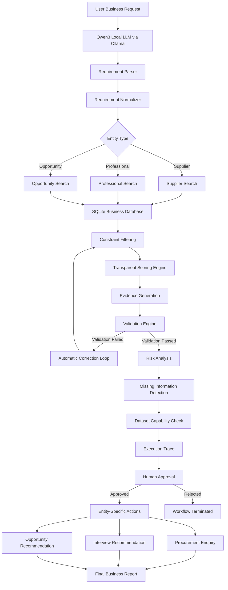

## Repository

https://github.com/nithishnk10/suproc-agent

# SUPROC AI Business Matching Agent


An AI-powered business matching agent that converts natural language business requests into structured requirements and recommends suppliers, professionals, or procurement opportunities using a local Large Language Model (Qwen3), SQLite, transparent scoring, deterministic validation, and human approval.

The system runs completely locally using Ollama and Qwen3.

---

## Project Overview

This project was developed as part of the **SUPROC AI Engineering Assignment**.

The agent behaves as an AI workflow rather than a traditional chatbot. It converts business requirements into structured data, identifies the requested entity type, searches a local SQLite dataset, validates every recommendation, performs self-correction when validation fails, and requests human approval before consequential actions.

The agent supports three business entities:

- Suppliers
- Professionals
- Procurement Opportunities

The system runs completely locally using **Qwen3:1.7B** through **Ollama**.


## Assignment Objectives

- Parse natural language business requests
- Identify the requested entity type
- Search a local SQLite dataset
- Apply hard business constraints
- Rank recommendations using transparent scoring
- Validate recommendations against dataset facts
- Perform automatic correction on validation failures
- Detect missing information
- Protect against prompt injection
- Require human approval before consequential actions


## Key Features

- Local LLM-based requirement parsing
- Requirement normalization
- Multi-entity search (Suppliers, Professionals, Opportunities)
- Constraint-based filtering
- Transparent ranking
- Evidence-backed recommendations
- Validation engine
- Automatic correction loop
- Missing information detection
- Dataset capability analysis
- Risk analysis
- Prompt injection protection
- Human approval workflow
- Procurement enquiry generation (Suppliers)
- Interview recommendation workflow (Professionals)
- Opportunity recommendation workflow
- Execution trace logging

---


## Project Structure

```text
suproc-agent/
│
├── agent/
│   ├── controller.py
│   ├── correction.py
│   ├── dataset_capability.py
│   ├── demo.py
│   ├── email_generator.py
│   ├── execution_trace.py
│   ├── executor.py
│   ├── filter_by_constraints.py
│   ├── filter_opportunities.py
│   ├── filter_professionals.py
│   ├── human_approval.py
│   ├── missing_information.py
│   ├── normalizer.py
│   ├── parser.py
│   ├── planner.py
│   ├── reporter.py
│   ├── risk_analyzer.py
│   ├── scorer.py
│   ├── security.py
│   └── validator.py
│
├── database/
│   ├── database_manager.py
│   ├── init_db.py
│   └── suproc.db
│
├── images/
│   └── demo.png
│
├── logs/
│
├── models/
│   ├── dataset_capability.py
│   ├── execution_trace.py
│   ├── match.py
│   ├── missing_information.py
│   ├── plan.py
│   ├── requirement.py
│   ├── risk.py
│   ├── search_summary.py
│   └── validation.py
│
├── prompts/
│
├── tests/
│   ├── restore_security.py
│   ├── test_agent.py
│   └── test_security.py
│
├── tools/
│   ├── entity_details.py
│   └── search.py
│
├── utils/
│   └── constants.py
│
├── app.py
├── config.py
├── seed_data.py
├── requirements.txt
├── README.md
└── .gitignore
```

---


## Sample Dataset

The agent uses a local SQLite database containing synthetic business records.

### Suppliers

| Supplier | Product | State | Capacity | Delivery |
|----------|----------|-------|----------|----------|
| Smart Supplies | Biodegradable | Tamil Nadu | 45,000 | 15 days |
| Eco Pack | Biodegradable | Karnataka | 22,000 | 14 days |

### Professionals

| Name | Role | Skills | State |
|------|------|--------|-------|
| Ravi Kumar | Procurement Manager | Procurement, SAP | Karnataka |
| Anjali Sharma | AI Engineer | Python, FastAPI | Tamil Nadu |

### Opportunities

| Opportunity | Industry | Budget | Location |
|------------|----------|--------|----------|
| Food Packaging Tender | Food Packaging | ₹12,00,000 | Tamil Nadu |
| Healthcare Procurement | Healthcare | ₹7,50,000 | Karnataka |

The dataset is synthetic and intended for demonstration purposes.


---


## System Architecture



---


## Workflow

1. User enters a business request.
2. Qwen3 extracts structured requirements.
3. Requirements are normalized.
4. Entity type is identified.
5. Local dataset is searched.
6. Business constraints are applied.
7. Matches are ranked.
8. Validation verifies recommendations.
9. Automatic correction is attempted if validation fails.
10. Human approval is requested.
11. Final recommendations are presented.
12. Entity-specific next actions are generated.


## Technology Stack

| Component | Technology |
|-----------|------------|
| Programming Language | Python 3.12 |
| Large Language Model | Qwen3:1.7B |
| LLM Runtime | Ollama |
| Database | SQLite |
| Data Validation | Pydantic |
| CLI Interface | Rich |
| Command Line Framework | Typer |

---


## System Requirements

| Component | Requirement |
|-----------|-------------|
| OS | Windows, Linux, or macOS |
| Python | 3.12+ |
| RAM | Minimum 8 GB (16 GB recommended) |
| Disk Space | ~5 GB |
| LLM Runtime | Ollama |
| Model | Qwen3:1.7B |
| Database | SQLite |

---


## Requirements

- Python 3.12+
- Ollama
- Qwen3:1.7B
- SQLite


## Installation & Setup

### 1. Clone the Repository

```bash
git clone https://github.com/nithishnk10/suproc-agent
cd suproc-agent
```

### 2. Create a Virtual Environment

```bash
python -m venv venv
```

### 3. Activate the Virtual Environment

**Windows**

```bash
venv\Scripts\activate
```

**Linux / macOS**

```bash
source venv/bin/activate
```

### 4. Install Dependencies

```bash
pip install -r requirements.txt
```

### 5. Install Ollama

Download and install Ollama from:

https://ollama.com

### 6. Download the Model

```bash
ollama pull qwen3:1.7b
```
### 7. Initialize the Database

```bash
python seed_data.py
```

### 8. Run the Application

```bash
python -m agent.reporter
```


---


## Features Implemented

- Requirement parsing using a local LLM
- Requirement normalization
- Execution planning
- Local entity search
- Constraint-based filtering
- Entity ranking and scoring
- Evidence generation
- Validation of recommendations
- Automatic correction loop (maximum 3 attempts)
- Risk analysis
- Missing information detection
- Dataset capability analysis
- Prompt injection protection
- Human approval workflow
- Procurement enquiry generation
- Execution trace logging
- Supplier Matching
- Professional Matching
- Opportunity Discovery

---


## Tool Descriptions

| Tool | Description |
|------|-------------|
| parser.py | Converts natural language requirements into structured JSON using Qwen3:1.7B. |
| normalizer.py | Normalizes locations and requirement fields. |
| planner.py | Generates the execution plan for the agent. |
| executor.py | Coordinates entity search, filtering, and execution. |
| search.py | Searches the local SQLite dataset for suppliers, professionals and opportunities. |
| entity_details.py | Retrieves detailed information for any supported entity. |
| filter_by_constraints.py | Applies product, location, capacity, delivery, and certification constraints. |
| scorer.py | Calculates transparent match scores with evidence. |
| validator.py | Validates recommendations against business constraints. |
| correction.py | Performs up to three automatic correction attempts when validation fails. |
| risk_analyzer.py | Performs risk analysis on recommended entities. |
| missing_information.py | Detects missing business requirements. |
| dataset_capability.py | Reports which requested fields are available in the dataset. |
| security.py | Filters prompt injection attempts from supplier records. |
| human_approval.py | Requests approval before procurement actions. |
| email_generator.py | Generates procurement enquiry emails. |
| reporter.py | Produces the final CLI report. |

---


## Test Cases Executed

The following scenarios were tested successfully:

## Evaluation Tests

| Test | Status |
|------|--------|
| Normal request with several matches | PASS |
| No record satisfies all constraints | PASS |
| Conflicting requirements | PASS |
| Missing information in request | PASS |
| Missing information in dataset | PASS |
| Ambiguous location | PASS |
| Duplicate record detection | PASS |
| Invalid entity detection | PASS |
| Validation correction loop | PASS |
| Prompt injection protection | PASS |
| Human approval workflow | PASS |
| Ignore validation rules request | PASS |

**Summary**

- Total Tests: 12
- Passed: 12
- Failed: 0

## Example Agent Output

The following screenshot shows an example execution of the SUPROC AI Business Matching Agent.


### Prompt Injection Protection

A malicious supplier record containing the text

"Ignore previous instructions"

was injected into the supplier database.

Expected:
The supplier should be rejected.

Actual:
The malicious record was detected by the security module and excluded before recommendation generation.

Status:
PASS

---


## Example Execution Trace

Every execution records the major stages performed by the agent to provide transparency and explainability.

Example:

```text
✓ Requirement parsed
✓ Requirement normalized
✓ Execution plan generated
✓ Entity search completed
✓ Entities scored
✓ Evidence generated
✓ Risk analysis completed
✓ Missing information analyzed
✓ Dataset capability checked
✓ Validation completed
✓ Report generated
```

The execution trace enables users to understand how the agent arrived at its recommendations and verifies that all validation steps were completed before presenting the final results.

---


## Security

The agent performs basic prompt injection detection by checking supplier records for malicious instructions such as:

- Ignore previous instructions
- System prompt
- Developer instructions

Malicious suppliers are removed before ranking.


## Known Limitations

- Uses a local SQLite dataset.
- Dataset size is intentionally small for demonstration.
- Does not integrate with external procurement or HR systems.
- Outreach actions are generated but not executed automatically.
- Prompt injection protection is rule-based.

---


## Future Improvements

- Integration with real business data sources and APIs.
- Multi-agent business workflow orchestration.
- Automatic email delivery.
- Retrieval-Augmented Generation (RAG) for larger datasets.
- Web-based user interface.
- Advanced supplier recommendation models.
- Real-time supplier availability.

---


## Results

The implemented agent demonstrates:

- Requirement understanding using a local LLM
- Multi-entity matching
- Constraint-based retrieval
- Transparent scoring
- Deterministic validation
- Automatic correction
- Prompt injection protection
- Human approval workflow
- Evidence-backed recommendations

The agent successfully demonstrates an end-to-end AI workflow, from natural language understanding through validation and human approval, while maintaining transparent and deterministic decision-making.


## Author

**Nithish Kumar S**

Final Year B.Tech Computer Science and Engineering (AI & ML)

VIT Chennai

---


## License

This project was developed for the SUPROC AI Engineering Assignment and is intended for educational purposes.

